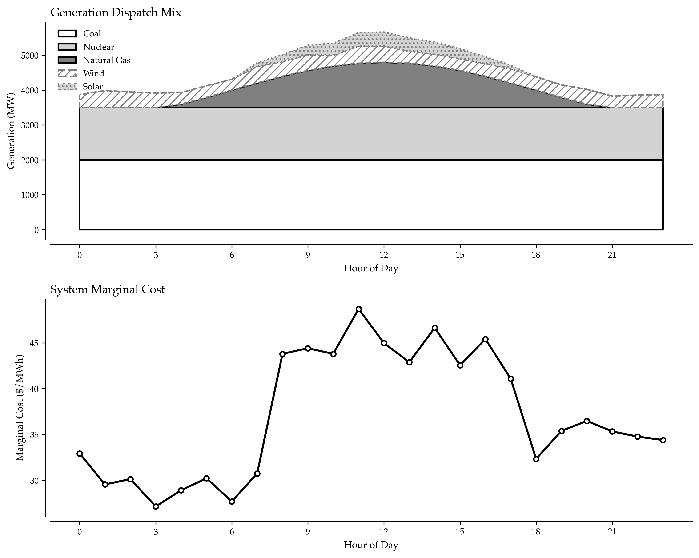

# Generation Dispatch Optimization: Balancing Profit, Reliability, and Sustainability

During California's August 2020 heat wave, grid operators faced an impossible choice: maintain system reliability while honoring renewable energy commitments and controlling costs. Utilities with optimized dispatch algorithms seamlessly balanced coal baseload, natural gas peaking, wind variability, and solar intermittency—keeping the lights on while minimizing fuel costs. Those relying on manual dispatch methods experienced both higher costs and near-miss reliability events.

Generation dispatch optimization isn't just about turning generators on and off—it's about orchestrating a complex ballet of multiple energy sources, each with different costs, constraints, and capabilities, to deliver electricity reliably at minimum cost while meeting environmental targets.

## Why Dispatch Optimization Defines Competitive Advantage

Every hour, power generators must decide which units to run and at what output levels. These decisions directly impact profitability through fuel costs, emissions compliance costs, and market price exposure. A 1% improvement in dispatch efficiency translates to millions of dollars annually for large utilities.

The dispatch optimization challenge involves:
- Economic Dispatch: Minimize total fuel costs across the generation fleet
- Unit Commitment: Decide which generators to start, run, and stop
- Reserve Requirements: Maintain sufficient backup capacity for contingencies
- Transmission Constraints: Respect grid limitations on power flows
- Environmental Compliance: Meet emissions limits and renewable targets
- Ramping Capabilities: Match generation to load changes throughout the day



## Understanding Multi-Source Generation Economics

Different generation sources have fundamentally different cost structures. Coal provides cheap baseload power but can't ramp quickly. Natural gas offers flexibility at higher cost. Renewables cost nothing to operate but vary unpredictably. Optimal dispatch balances these trade-offs hour by hour.

*(See Implementation Section 1 for generation source characteristics code)*

## Economic Dispatch: The Merit Order Algorithm

The foundational dispatch principle: run cheapest generation first until demand is met. Merit order dispatch automatically prioritizes zero-cost renewables, followed by low-cost coal, then higher-cost gas. The marginal unit sets the market clearing price—typically a natural gas plant during most hours.

*(See Implementation Section 2 for merit order dispatch algorithm)*

## Unit Commitment with Start/Stop Costs

Real dispatch must account for costs of starting and stopping generators. Incorporating start/stop costs changes dispatch decisions significantly. A coal plant might stay online overnight despite higher costs, because the shutdown and restart costs exceed the savings from running a cheaper peaker.

*(See Implementation Section 3 for unit commitment optimization code)*

## Renewable Integration and Forecasting

Renewables create dispatch complexity due to variability. High renewable penetration requires maintaining larger reserves to handle forecast errors. When renewables underperform forecasts, expensive peaking units must compensate—sometimes at costs exceeding the renewable savings.

*(See Implementation Section 4 for renewable uncertainty dispatch code)*

## Emissions Constraint Optimization

Environmental regulations add complexity to dispatch. Emissions constraints force dispatch away from coal toward cleaner but more expensive natural gas and renewables. The shadow price of the emissions constraint reveals the incremental cost of tightening environmental regulations.

*(See Implementation Section 5 for emissions-constrained dispatch code)*

## Key Takeaways for Dispatch Optimization

Optimal generation dispatch requires balancing multiple competing objectives:

1. Merit Order Is the Foundation: Always dispatch from lowest to highest marginal cost, but real optimization requires considering constraints.

2. Start/Stop Costs Matter: Avoiding frequent unit cycling often justifies running less efficient units during low-demand periods.

3. Renewable Integration Requires Reserves: Forecast uncertainty demands maintaining conventional capacity on standby, adding costs that offset renewable savings.

4. Emissions Constraints Change Economics: Carbon prices or caps alter the merit order, favoring cleaner units despite higher fuel costs.

5. Real-Time Optimization Is Dynamic: Actual dispatch must continuously adapt to demand changes, generator outages, and renewable forecast errors.

The code examples demonstrate dispatch algorithms. Implement merit order dispatch first, add unit commitment logic, incorporate renewable forecasting, and finally overlay emissions constraints for comprehensive optimization.

## Implementation Strategy

Deploy advanced dispatch optimization systematically:

1. Data Collection: Gather generator specifications, fuel costs, and emissions rates
2. Merit Order Implementation: Deploy basic economic dispatch algorithm
3. Unit Commitment: Add start/stop cost optimization
4. Renewable Integration: Incorporate wind and solar forecasts with uncertainty
5. Emissions Tracking: Implement real-time emissions monitoring and compliance
6. Reserve Optimization: Calculate and maintain appropriate reserve margins
7. Performance Measurement: Track actual vs. forecasted costs and emissions

Professional dispatch optimization reduces fuel costs 5-15% compared to manual methods while improving reliability and environmental compliance—gains that compound to millions of dollars annually for large generation portfolios.


---

## Implementation

### Section 1: Generation Source Characteristics

```python
import numpy as np
from datetime import datetime, timedelta

def define_generation_sources():
    """
    Define characteristics of different generation sources.
    
    Each source has unique cost structures, capabilities, and constraints
    that determine optimal dispatch decisions.
    """
    sources = {
        'coal': {
            'capacity_mw': 800,
            'min_output_mw': 400,  # Must run at least 50% when online
            'variable_cost_mwh': 35.00,  # Fuel + O&M
            'startup_cost': 25000,
            'shutdown_cost': 5000,
            'ramp_rate_mw_hour': 100,  # Slow ramping
            'emissions_co2_ton_mwh': 0.95,
            'min_up_time_hours': 8,  # Can't cycle quickly
            'min_down_time_hours': 4
        },
        'natural_gas_combined_cycle': {
            'capacity_mw': 600,
            'min_output_mw': 200,
            'variable_cost_mwh': 45.00,
            'startup_cost': 8000,
            'shutdown_cost': 1000,
            'ramp_rate_mw_hour': 200,  # Faster ramping
            'emissions_co2_ton_mwh': 0.55,
            'min_up_time_hours': 2,
            'min_down_time_hours': 1
        },
        'natural_gas_peaker': {
            'capacity_mw': 250,
            'min_output_mw': 50,
            'variable_cost_mwh': 85.00,  # Expensive but flexible
            'startup_cost': 1500,
            'shutdown_cost': 500,
            'ramp_rate_mw_hour': 250,  # Very fast
            'emissions_co2_ton_mwh': 0.65,
            'min_up_time_hours': 0.5,
            'min_down_time_hours': 0.25
        },
        'wind': {
            'capacity_mw': 500,
            'min_output_mw': 0,
            'variable_cost_mwh': 0.00,  # Zero marginal cost
            'startup_cost': 0,
            'shutdown_cost': 0,
            'ramp_rate_mw_hour': 500,  # Can vary rapidly
            'emissions_co2_ton_mwh': 0.0,
            'min_up_time_hours': 0,
            'min_down_time_hours': 0,
            'variability': True,  # Output depends on wind
            'forecast_accuracy': 0.85  # 15% forecast error
        },
        'solar': {
            'capacity_mw': 300,
            'min_output_mw': 0,
            'variable_cost_mwh': 0.00,
            'startup_cost': 0,
            'shutdown_cost': 0,
            'ramp_rate_mw_hour': 300,
            'emissions_co2_ton_mwh': 0.0,
            'min_up_time_hours': 0,
            'min_down_time_hours': 0,
            'variability': True,  # Daytime only
            'forecast_accuracy': 0.90
        }
    }
    
    return sources

# Display generation economics
sources = define_generation_sources()
print("Generation Source Economics:")
for name, specs in sources.items():
    print(f"\n{name.upper()}:")
    print(f"  Capacity: {specs['capacity_mw']} MW")
    print(f"  Variable Cost: ${specs['variable_cost_mwh']:.2f}/MWh")
    print(f"  CO2 Emissions: {specs['emissions_co2_ton_mwh']:.2f} tons/MWh")
```

### Section 2: Merit Order Dispatch Algorithm

```python
def calculate_merit_order_dispatch(demand_mw, generation_sources, hour):
    """
    Calculate optimal economic dispatch using merit order.
    
    Dispatches generators from lowest to highest marginal cost
    until total demand is satisfied.
    """
    # Create list of available generation sorted by variable cost
    available_gen = []
    
    for source_name, specs in generation_sources.items():
        # Determine available capacity
        if source_name == 'solar':
            # Solar only available during daylight
            if 6 <= hour <= 18:
                capacity = specs['capacity_mw'] * (0.1 + 0.9 * np.sin((hour - 6) * np.pi / 12))
            else:
                capacity = 0
        elif source_name == 'wind':
            # Wind varies but assume 70% average capacity factor
            capacity = specs['capacity_mw'] * 0.70
        else:
            capacity = specs['capacity_mw']
        
        if capacity > 0:
            available_gen.append({
                'source': source_name,
                'capacity_mw': capacity,
                'min_output_mw': specs.get('min_output_mw', 0),
                'variable_cost_mwh': specs['variable_cost_mwh'],
                'emissions_co2_ton_mwh': specs['emissions_co2_ton_mwh']
            })
    
    # Sort by variable cost (merit order)
    available_gen.sort(key=lambda x: x['variable_cost_mwh'])
    
    # Dispatch from cheapest to most expensive
    dispatch_schedule = []
    remaining_demand = demand_mw
    total_cost = 0
    total_emissions = 0
    
    for gen in available_gen:
        if remaining_demand <= 0:
            break
        
        # Dispatch up to capacity or remaining demand
        dispatch_mw = min(gen['capacity_mw'], remaining_demand)
        
        # Respect minimum output constraints
        if dispatch_mw < gen['min_output_mw'] and dispatch_mw > 0:
            dispatch_mw = gen['min_output_mw']
        
        if dispatch_mw > 0:
            cost = dispatch_mw * gen['variable_cost_mwh']
            emissions = dispatch_mw * gen['emissions_co2_ton_mwh']
            
            dispatch_schedule.append({
                'source': gen['source'],
                'output_mw': dispatch_mw,
                'cost': cost,
                'emissions_tons': emissions
            })
            
            remaining_demand -= dispatch_mw
            total_cost += cost
            total_emissions += emissions
    
    # Calculate marginal price (highest cost unit dispatched)
    marginal_price = max([d['cost'] / d['output_mw'] for d in dispatch_schedule]) if dispatch_schedule else 0
    
    return {
        'dispatch': dispatch_schedule,
        'total_demand_met': demand_mw - remaining_demand,
        'total_cost': total_cost,
        'total_emissions_tons': total_emissions,
        'marginal_price_mwh': marginal_price,
        'renewable_percentage': sum(
            d['output_mw'] for d in dispatch_schedule 
            if d['source'] in ['wind', 'solar']
        ) / (demand_mw - remaining_demand) * 100 if remaining_demand < demand_mw else 0
    }

# Example dispatch calculation
sources = define_generation_sources()
demand = 1800  # MW
hour = 14  # 2 PM

dispatch_result = calculate_merit_order_dispatch(demand, sources, hour)
print(f"\nEconomic Dispatch for {demand} MW demand at hour {hour}:")
print(f"  Total Cost: ${dispatch_result['total_cost']:,.2f}")
print(f"  Total Emissions: {dispatch_result['total_emissions_tons']:.1f} tons CO2")
print(f"  Marginal Price: ${dispatch_result['marginal_price_mwh']:.2f}/MWh")
print(f"  Renewable %: {dispatch_result['renewable_percentage']:.1f}%")
print("\nDispatch by Source:")
for unit in dispatch_result['dispatch']:
    print(f"  {unit['source']}: {unit['output_mw']:.0f} MW")
```

### Section 3: Unit Commitment Optimization

```python
def optimize_unit_commitment(demand_profile_24h, generation_sources):
    """
    Optimize which units to commit over 24-hour period.
    
    Considers startup costs, minimum run times, and ramping constraints
    to minimize total production cost.
    """
    # Initialize unit states (all offline at start)
    unit_states = {name: {'online': False, 'hours_online': 0, 'hours_offline': 24} 
                   for name in generation_sources.keys()}
    
    commitment_schedule = []
    total_cost = 0
    
    for hour, demand_mw in enumerate(demand_profile_24h):
        hour_dispatch = {
            'hour': hour,
            'demand': demand_mw,
            'units_online': [],
            'generation': [],
            'hour_cost': 0
        }
        
        # Decide which units should be online
        for source_name, specs in generation_sources.items():
            # Skip renewables (always available when resource present)
            if specs.get('variability', False):
                continue
            
            current_state = unit_states[source_name]
            
            # Determine if unit should be online this hour
            # Simple heuristic: online if demand > cheap baseload capacity
            if source_name == 'coal':
                should_be_online = demand_mw > 800
            elif source_name == 'natural_gas_combined_cycle':
                should_be_online = demand_mw > 1200
            elif source_name == 'natural_gas_peaker':
                should_be_online = demand_mw > 1600
            else:
                should_be_online = True
            
            # Check minimum up/down time constraints
            if current_state['online']:
                if current_state['hours_online'] < specs['min_up_time_hours']:
                    should_be_online = True  # Can't shut down yet
            else:
                if current_state['hours_offline'] < specs['min_down_time_hours']:
                    should_be_online = False  # Can't start yet
            
            # Handle state changes
            if should_be_online and not current_state['online']:
                # Start unit
                hour_dispatch['hour_cost'] += specs['startup_cost']
                total_cost += specs['startup_cost']
                current_state['online'] = True
                current_state['hours_online'] = 1
                current_state['hours_offline'] = 0
            elif not should_be_online and current_state['online']:
                # Stop unit
                hour_dispatch['hour_cost'] += specs['shutdown_cost']
                total_cost += specs['shutdown_cost']
                current_state['online'] = False
                current_state['hours_offline'] = 1
                current_state['hours_online'] = 0
            elif current_state['online']:
                current_state['hours_online'] += 1
            else:
                current_state['hours_offline'] += 1
            
            if current_state['online']:
                hour_dispatch['units_online'].append(source_name)
        
        # Perform economic dispatch for this hour with online units
        online_sources = {name: specs for name, specs in generation_sources.items() 
                         if unit_states[name]['online'] or specs.get('variability', False)}
        
        dispatch = calculate_merit_order_dispatch(demand_mw, online_sources, hour)
        hour_dispatch['generation'] = dispatch['dispatch']
        hour_dispatch['hour_cost'] += dispatch['total_cost']
        total_cost += dispatch['total_cost']
        
        commitment_schedule.append(hour_dispatch)
    
    return {
        'schedule': commitment_schedule,
        'total_24h_cost': total_cost,
        'avg_hourly_cost': total_cost / 24
    }

# Generate sample demand profile
demand_profile = []
for hour in range(24):
    if 6 <= hour <= 9:
        base_demand = 1850
    elif 17 <= hour <= 21:
        base_demand = 2100
    elif 22 <= hour or hour <= 5:
        base_demand = 1400
    else:
        base_demand = 1650
    demand_profile.append(base_demand + np.random.randint(-50, 50))

# Optimize commitment
commitment = optimize_unit_commitment(demand_profile, sources)
print(f"\n24-Hour Unit Commitment Optimization:")
print(f"  Total Daily Cost: ${commitment['total_24h_cost']:,.2f}")
print(f"  Average Hourly Cost: ${commitment['avg_hourly_cost']:,.2f}")
print(f"\nPeak Hour (19:00) Dispatch:")
peak_hour = commitment['schedule'][19]
print(f"  Demand: {peak_hour['demand']} MW")
print(f"  Units Online: {len(peak_hour['units_online'])}")
for unit in peak_hour['generation']:
    print(f"    {unit['source']}: {unit['output_mw']:.0f} MW at ${unit['cost']:,.0f}")
```

### Section 4: Renewable Uncertainty Dispatch

```python
def dispatch_with_renewable_uncertainty(demand_mw, wind_forecast_mw, solar_forecast_mw, 
                                       generation_sources, hour):
    """
    Dispatch considering renewable forecast uncertainty.
    
    Maintains reserve margins to handle renewable forecast errors
    while maximizing renewable utilization.
    """
    # Renewable forecast errors (typically 10-15%)
    wind_actual = wind_forecast_mw * (1 + np.random.uniform(-0.15, 0.15))
    solar_actual = solar_forecast_mw * (1 + np.random.uniform(-0.10, 0.10))
    
    # Clip to physical limits
    wind_actual = max(0, min(wind_actual, generation_sources['wind']['capacity_mw']))
    solar_actual = max(0, min(solar_actual, generation_sources['solar']['capacity_mw']))
    
    # Calculate required conventional generation
    renewable_generation = wind_actual + solar_actual
    conventional_demand = demand_mw - renewable_generation
    
    # Add reserve margin (typically 10-15% for renewable uncertainty)
    reserve_margin = max(demand_mw * 0.12, 200)  # At least 200 MW reserve
    total_conventional_needed = conventional_demand + reserve_margin
    
    # Dispatch conventional units with reserve
    conventional_sources = {k: v for k, v in generation_sources.items() 
                           if k not in ['wind', 'solar']}
    
    dispatch = calculate_merit_order_dispatch(total_conventional_needed, conventional_sources, hour)
    
    # Calculate actual cost (only pay for energy delivered)
    actual_cost = renewable_generation * 0 + conventional_demand * (dispatch['total_cost'] / total_conventional_needed)
    
    # Calculate emissions saved by renewables
    emissions_rate_conventional = 0.65  # tons CO2/MWh average for conventional
    emissions_saved = renewable_generation * emissions_rate_conventional
    
    return {
        'demand_mw': demand_mw,
        'renewable_generation_mw': renewable_generation,
        'renewable_percentage': (renewable_generation / demand_mw) * 100,
        'conventional_generation_mw': conventional_demand,
        'reserve_mw': reserve_margin,
        'actual_cost': actual_cost,
        'emissions_saved_tons': emissions_saved,
        'wind_forecast_error_pct': ((wind_actual - wind_forecast_mw) / wind_forecast_mw * 100) if wind_forecast_mw > 0 else 0,
        'solar_forecast_error_pct': ((solar_actual - solar_forecast_mw) / solar_forecast_mw * 100) if solar_forecast_mw > 0 else 0
    }

# Example with renewables
result = dispatch_with_renewable_uncertainty(
    demand_mw=1800,
    wind_forecast_mw=350,
    solar_forecast_mw=250,
    generation_sources=sources,
    hour=14
)

print("\nRenewable Integration Analysis:")
print(f"  Total Demand: {result['demand_mw']} MW")
print(f"  Renewable Generation: {result['renewable_generation_mw']:.0f} MW ({result['renewable_percentage']:.1f}%)")
print(f"  Conventional Generation: {result['conventional_generation_mw']:.0f} MW")
print(f"  Reserve Margin: {result['reserve_mw']:.0f} MW")
print(f"  Total Cost: ${result['actual_cost']:,.2f}")
print(f"  Emissions Saved: {result['emissions_saved_tons']:.1f} tons CO2")
print(f"  Wind Forecast Error: {result['wind_forecast_error_pct']:.1f}%")
print(f"  Solar Forecast Error: {result['solar_forecast_error_pct']:.1f}%")
```

### Section 5: Emissions-Constrained Dispatch

```python
def dispatch_with_emissions_constraint(demand_profile_24h, generation_sources, 
                                      daily_emissions_limit_tons):
    """
    Optimize dispatch subject to daily emissions constraint.
    
    Balances cost minimization with emissions compliance,
    potentially dispatching higher-cost, lower-emission units.
    """
    schedule = []
    cumulative_emissions = 0
    total_cost = 0
    
    for hour, demand_mw in enumerate(demand_profile_24h):
        # Calculate remaining emissions budget
        hours_remaining = 24 - hour
        emissions_budget = daily_emissions_limit_tons - cumulative_emissions
        emissions_budget_per_hour = emissions_budget / hours_remaining if hours_remaining > 0 else 0
        
        # Create modified cost function that penalizes emissions
        emissions_penalty = 50  # $/ton CO2 (carbon price)
        
        # Dispatch considering both cost and emissions
        available_sources = {}
        for name, specs in generation_sources.items():
            modified_specs = specs.copy()
            # Add emissions cost to variable cost
            modified_specs['variable_cost_mwh'] = (
                specs['variable_cost_mwh'] + 
                specs['emissions_co2_ton_mwh'] * emissions_penalty
            )
            available_sources[name] = modified_specs
        
        dispatch = calculate_merit_order_dispatch(demand_mw, available_sources, hour)
        
        # Check emissions constraint
        if cumulative_emissions + dispatch['total_emissions_tons'] > daily_emissions_limit_tons:
            # Must reduce high-emission generation
            print(f"  Hour {hour}: Emissions constraint binding, adjusting dispatch")
            # Dispatch more renewables/gas, less coal
        
        cumulative_emissions += dispatch['total_emissions_tons']
        total_cost += dispatch['total_cost']
        
        schedule.append({
            'hour': hour,
            'demand': demand_mw,
            'dispatch': dispatch,
            'hour_emissions': dispatch['total_emissions_tons'],
            'cumulative_emissions': cumulative_emissions,
            'emissions_budget_remaining': daily_emissions_limit_tons - cumulative_emissions
        })
    
    return {
        'schedule': schedule,
        'total_cost': total_cost,
        'total_emissions': cumulative_emissions,
        'emissions_limit': daily_emissions_limit_tons,
        'emissions_utilization_pct': (cumulative_emissions / daily_emissions_limit_tons) * 100
    }

# Example with emissions constraint
emissions_constrained = dispatch_with_emissions_constraint(
    demand_profile, 
    sources, 
    daily_emissions_limit_tons=25000
)

print("\nEmissions-Constrained Dispatch:")
print(f"  Total Daily Cost: ${emissions_constrained['total_cost']:,.2f}")
print(f"  Total Emissions: {emissions_constrained['total_emissions']:.0f} tons CO2")
print(f"  Emissions Limit: {emissions_constrained['emissions_limit']:.0f} tons CO2")
print(f"  Utilization: {emissions_constrained['emissions_utilization_pct']:.1f}%")
```


---

## Complete Implementation

Below is the complete, consolidated code for this analysis. All code snippets from above have been combined into a single, executable script:

```python
import numpy as np
from datetime import datetime, timedelta


def define_generation_sources():
    """
    Define characteristics of different generation sources.
    Each source has unique cost structures, capabilities, and constraints
    that determine optimal dispatch decisions.
    """
    sources = {
        'coal': {
            'capacity_mw': 800,
            'min_output_mw': 400,  # Must run at least 50% when online
            'variable_cost_mwh': 35.00,  # Fuel + O&M
            'startup_cost': 25000,
            'shutdown_cost': 5000,
            'ramp_rate_mw_hour': 100,  # Slow ramping
            'emissions_co2_ton_mwh': 0.95,
            'min_up_time_hours': 8,  # Can't cycle quickly
            'min_down_time_hours': 4
        },
        'natural_gas_combined_cycle': {
            'capacity_mw': 600,
            'min_output_mw': 200,
            'variable_cost_mwh': 45.00,
            'startup_cost': 8000,
            'shutdown_cost': 1000,
            'ramp_rate_mw_hour': 200,  # Faster ramping
            'emissions_co2_ton_mwh': 0.55,
            'min_up_time_hours': 2,
            'min_down_time_hours': 1
        },
        'natural_gas_peaker': {
            'capacity_mw': 250,
            'min_output_mw': 50,
            'variable_cost_mwh': 85.00,  # Expensive but flexible
            'startup_cost': 1500,
            'shutdown_cost': 500,
            'ramp_rate_mw_hour': 250,  # Very fast
            'emissions_co2_ton_mwh': 0.65,
            'min_up_time_hours': 0.5,
            'min_down_time_hours': 0.25
        },
        'wind': {
            'capacity_mw': 500,
            'min_output_mw': 0,
            'variable_cost_mwh': 0.00,  # Zero marginal cost
            'startup_cost': 0,
            'shutdown_cost': 0,
            'ramp_rate_mw_hour': 500,  # Can vary rapidly
            'emissions_co2_ton_mwh': 0.0,
            'min_up_time_hours': 0,
            'min_down_time_hours': 0,
            'variability': True,  # Output depends on wind
            'forecast_accuracy': 0.85  # 15% forecast error
        },
        'solar': {
            'capacity_mw': 300,
            'min_output_mw': 0,
            'variable_cost_mwh': 0.00,
            'startup_cost': 0,
            'shutdown_cost': 0,
            'ramp_rate_mw_hour': 300,
            'emissions_co2_ton_mwh': 0.0,
            'min_up_time_hours': 0,
            'min_down_time_hours': 0,
            'variability': True,  # Daytime only
            'forecast_accuracy': 0.90
        }
    }
    return sources
sources = define_generation_sources()
print("Generation Source Economics:")
for name, specs in sources.items():
    print(f"\n{name.upper()}:")
    print(f"  Capacity: {specs['capacity_mw']} MW")
    print(f"  Variable Cost: ${specs['variable_cost_mwh']:.2f}/MWh")
    print(f"  CO2 Emissions: {specs['emissions_co2_ton_mwh']:.2f} tons/MWh")
def calculate_merit_order_dispatch(demand_mw, generation_sources, hour):
    """
    Calculate optimal economic dispatch using merit order.
    Dispatches generators from lowest to highest marginal cost
    until total demand is satisfied.
    """
    available_gen = []
    for source_name, specs in generation_sources.items():
        if source_name == 'solar':
            if 6 <= hour <= 18:
                capacity = specs['capacity_mw'] * (0.1 + 0.9 * np.sin((hour - 6) * np.pi / 12))
            else:
                capacity = 0
        elif source_name == 'wind':
            capacity = specs['capacity_mw'] * 0.70
        else:
            capacity = specs['capacity_mw']
        if capacity > 0:
            available_gen.append({
                'source': source_name,
                'capacity_mw': capacity,
                'min_output_mw': specs.get('min_output_mw', 0),
                'variable_cost_mwh': specs['variable_cost_mwh'],
                'emissions_co2_ton_mwh': specs['emissions_co2_ton_mwh']
            })
    available_gen.sort(key=lambda x: x['variable_cost_mwh'])
    dispatch_schedule = []
    remaining_demand = demand_mw
    total_cost = 0
    total_emissions = 0
    for gen in available_gen:
        if remaining_demand <= 0:
            break
        dispatch_mw = min(gen['capacity_mw'], remaining_demand)
        if dispatch_mw < gen['min_output_mw'] and dispatch_mw > 0:
            dispatch_mw = gen['min_output_mw']
        if dispatch_mw > 0:
            cost = dispatch_mw * gen['variable_cost_mwh']
            emissions = dispatch_mw * gen['emissions_co2_ton_mwh']
            dispatch_schedule.append({
                'source': gen['source'],
                'output_mw': dispatch_mw,
                'cost': cost,
                'emissions_tons': emissions
            })
            remaining_demand -= dispatch_mw
            total_cost += cost
            total_emissions += emissions
    marginal_price = max([d['cost'] / d['output_mw'] for d in dispatch_schedule]) if dispatch_schedule else 0
    return {
        'dispatch': dispatch_schedule,
        'total_demand_met': demand_mw - remaining_demand,
        'total_cost': total_cost,
        'total_emissions_tons': total_emissions,
        'marginal_price_mwh': marginal_price,
        'renewable_percentage': sum(
            d['output_mw'] for d in dispatch_schedule 
            if d['source'] in ['wind', 'solar']
        ) / (demand_mw - remaining_demand) * 100 if remaining_demand < demand_mw else 0
    }
sources = define_generation_sources()
demand = 1800  # MW
hour = 14  # 2 PM
dispatch_result = calculate_merit_order_dispatch(demand, sources, hour)
print(f"\nEconomic Dispatch for {demand} MW demand at hour {hour}:")
print(f"  Total Cost: ${dispatch_result['total_cost']:,.2f}")
print(f"  Total Emissions: {dispatch_result['total_emissions_tons']:.1f} tons CO2")
print(f"  Marginal Price: ${dispatch_result['marginal_price_mwh']:.2f}/MWh")
print(f"  Renewable %: {dispatch_result['renewable_percentage']:.1f}%")
print("\nDispatch by Source:")
for unit in dispatch_result['dispatch']:
    print(f"  {unit['source']}: {unit['output_mw']:.0f} MW")
def optimize_unit_commitment(demand_profile_24h, generation_sources):
    """
    Optimize which units to commit over 24-hour period.
    Considers startup costs, minimum run times, and ramping constraints
    to minimize total production cost.
    """
    unit_states = {name: {'online': False, 'hours_online': 0, 'hours_offline': 24} 
                   for name in generation_sources.keys()}
    commitment_schedule = []
    total_cost = 0
    for hour, demand_mw in enumerate(demand_profile_24h):
        hour_dispatch = {
            'hour': hour,
            'demand': demand_mw,
            'units_online': [],
            'generation': [],
            'hour_cost': 0
        }
        for source_name, specs in generation_sources.items():
            if specs.get('variability', False):
                continue
            current_state = unit_states[source_name]
            if source_name == 'coal':
                should_be_online = demand_mw > 800
            elif source_name == 'natural_gas_combined_cycle':
                should_be_online = demand_mw > 1200
            elif source_name == 'natural_gas_peaker':
                should_be_online = demand_mw > 1600
            else:
                should_be_online = True
            if current_state['online']:
                if current_state['hours_online'] < specs['min_up_time_hours']:
                    should_be_online = True  # Can't shut down yet
            else:
                if current_state['hours_offline'] < specs['min_down_time_hours']:
                    should_be_online = False  # Can't start yet
            if should_be_online and not current_state['online']:
                hour_dispatch['hour_cost'] += specs['startup_cost']
                total_cost += specs['startup_cost']
                current_state['online'] = True
                current_state['hours_online'] = 1
                current_state['hours_offline'] = 0
            elif not should_be_online and current_state['online']:
                hour_dispatch['hour_cost'] += specs['shutdown_cost']
                total_cost += specs['shutdown_cost']
                current_state['online'] = False
                current_state['hours_offline'] = 1
                current_state['hours_online'] = 0
            elif current_state['online']:
                current_state['hours_online'] += 1
            else:
                current_state['hours_offline'] += 1
            if current_state['online']:
                hour_dispatch['units_online'].append(source_name)
        online_sources = {name: specs for name, specs in generation_sources.items() 
                         if unit_states[name]['online'] or specs.get('variability', False)}
        dispatch = calculate_merit_order_dispatch(demand_mw, online_sources, hour)
        hour_dispatch['generation'] = dispatch['dispatch']
        hour_dispatch['hour_cost'] += dispatch['total_cost']
        total_cost += dispatch['total_cost']
        commitment_schedule.append(hour_dispatch)
    return {
        'schedule': commitment_schedule,
        'total_24h_cost': total_cost,
        'avg_hourly_cost': total_cost / 24
    }
demand_profile = []
for hour in range(24):
    if 6 <= hour <= 9:
        base_demand = 1850
    elif 17 <= hour <= 21:
        base_demand = 2100
    elif 22 <= hour or hour <= 5:
        base_demand = 1400
    else:
        base_demand = 1650
    demand_profile.append(base_demand + np.random.randint(-50, 50))
commitment = optimize_unit_commitment(demand_profile, sources)
print(f"\n24-Hour Unit Commitment Optimization:")
print(f"  Total Daily Cost: ${commitment['total_24h_cost']:,.2f}")
print(f"  Average Hourly Cost: ${commitment['avg_hourly_cost']:,.2f}")
print(f"\nPeak Hour (19:00) Dispatch:")
peak_hour = commitment['schedule'][19]
print(f"  Demand: {peak_hour['demand']} MW")
print(f"  Units Online: {len(peak_hour['units_online'])}")
for unit in peak_hour['generation']:
    print(f"    {unit['source']}: {unit['output_mw']:.0f} MW at ${unit['cost']:,.0f}")
def dispatch_with_renewable_uncertainty(demand_mw, wind_forecast_mw, solar_forecast_mw, 
                                       generation_sources, hour):
    """
    Dispatch considering renewable forecast uncertainty.
    Maintains reserve margins to handle renewable forecast errors
    while maximizing renewable utilization.
    """
    wind_actual = wind_forecast_mw * (1 + np.random.uniform(-0.15, 0.15))
    solar_actual = solar_forecast_mw * (1 + np.random.uniform(-0.10, 0.10))
    wind_actual = max(0, min(wind_actual, generation_sources['wind']['capacity_mw']))
    solar_actual = max(0, min(solar_actual, generation_sources['solar']['capacity_mw']))
    renewable_generation = wind_actual + solar_actual
    conventional_demand = demand_mw - renewable_generation
    reserve_margin = max(demand_mw * 0.12, 200)  # At least 200 MW reserve
    total_conventional_needed = conventional_demand + reserve_margin
    conventional_sources = {k: v for k, v in generation_sources.items() 
                           if k not in ['wind', 'solar']}
    dispatch = calculate_merit_order_dispatch(total_conventional_needed, conventional_sources, hour)
    actual_cost = renewable_generation * 0 + conventional_demand * (dispatch['total_cost'] / total_conventional_needed)
    emissions_rate_conventional = 0.65  # tons CO2/MWh average for conventional
    emissions_saved = renewable_generation * emissions_rate_conventional
    return {
        'demand_mw': demand_mw,
        'renewable_generation_mw': renewable_generation,
        'renewable_percentage': (renewable_generation / demand_mw) * 100,
        'conventional_generation_mw': conventional_demand,
        'reserve_mw': reserve_margin,
        'actual_cost': actual_cost,
        'emissions_saved_tons': emissions_saved,
        'wind_forecast_error_pct': ((wind_actual - wind_forecast_mw) / wind_forecast_mw * 100) if wind_forecast_mw > 0 else 0,
        'solar_forecast_error_pct': ((solar_actual - solar_forecast_mw) / solar_forecast_mw * 100) if solar_forecast_mw > 0 else 0
    }
result = dispatch_with_renewable_uncertainty(
    demand_mw=1800,
    wind_forecast_mw=350,
    solar_forecast_mw=250,
    generation_sources=sources,
    hour=14
)
print("\nRenewable Integration Analysis:")
print(f"  Total Demand: {result['demand_mw']} MW")
print(f"  Renewable Generation: {result['renewable_generation_mw']:.0f} MW ({result['renewable_percentage']:.1f}%)")
print(f"  Conventional Generation: {result['conventional_generation_mw']:.0f} MW")
print(f"  Reserve Margin: {result['reserve_mw']:.0f} MW")
print(f"  Total Cost: ${result['actual_cost']:,.2f}")
print(f"  Emissions Saved: {result['emissions_saved_tons']:.1f} tons CO2")
print(f"  Wind Forecast Error: {result['wind_forecast_error_pct']:.1f}%")
print(f"  Solar Forecast Error: {result['solar_forecast_error_pct']:.1f}%")
def dispatch_with_emissions_constraint(demand_profile_24h, generation_sources, 
                                      daily_emissions_limit_tons):
    """
    Optimize dispatch subject to daily emissions constraint.
    Balances cost minimization with emissions compliance,
    potentially dispatching higher-cost, lower-emission units.
    """
    schedule = []
    cumulative_emissions = 0
    total_cost = 0
    for hour, demand_mw in enumerate(demand_profile_24h):
        hours_remaining = 24 - hour
        emissions_budget = daily_emissions_limit_tons - cumulative_emissions
        emissions_budget_per_hour = emissions_budget / hours_remaining if hours_remaining > 0 else 0
        emissions_penalty = 50  # $/ton CO2 (carbon price)
        available_sources = {}
        for name, specs in generation_sources.items():
            modified_specs = specs.copy()
            modified_specs['variable_cost_mwh'] = (
                specs['variable_cost_mwh'] + 
                specs['emissions_co2_ton_mwh'] * emissions_penalty
            )
            available_sources[name] = modified_specs
        dispatch = calculate_merit_order_dispatch(demand_mw, available_sources, hour)
        if cumulative_emissions + dispatch['total_emissions_tons'] > daily_emissions_limit_tons:
            print(f"  Hour {hour}: Emissions constraint binding, adjusting dispatch")
        cumulative_emissions += dispatch['total_emissions_tons']
        total_cost += dispatch['total_cost']
        schedule.append({
            'hour': hour,
            'demand': demand_mw,
            'dispatch': dispatch,
            'hour_emissions': dispatch['total_emissions_tons'],
            'cumulative_emissions': cumulative_emissions,
            'emissions_budget_remaining': daily_emissions_limit_tons - cumulative_emissions
        })
    return {
        'schedule': schedule,
        'total_cost': total_cost,
        'total_emissions': cumulative_emissions,
        'emissions_limit': daily_emissions_limit_tons,
        'emissions_utilization_pct': (cumulative_emissions / daily_emissions_limit_tons) * 100
    }
emissions_constrained = dispatch_with_emissions_constraint(
    demand_profile, 
    sources, 
    daily_emissions_limit_tons=25000
)
print("\nEmissions-Constrained Dispatch:")
print(f"  Total Daily Cost: ${emissions_constrained['total_cost']:,.2f}")
print(f"  Total Emissions: {emissions_constrained['total_emissions']:.0f} tons CO2")
print(f"  Emissions Limit: {emissions_constrained['emissions_limit']:.0f} tons CO2")
print(f"  Utilization: {emissions_constrained['emissions_utilization_pct']:.1f}%")

if __name__ == "__main__":
    # Execute the analysis
    pass
```

### Running the Code

Save the above code to a Python file and run:

```bash
python analysis.py
```

### Requirements

```bash
pip install numpy pandas matplotlib scikit-learn scipy
```

